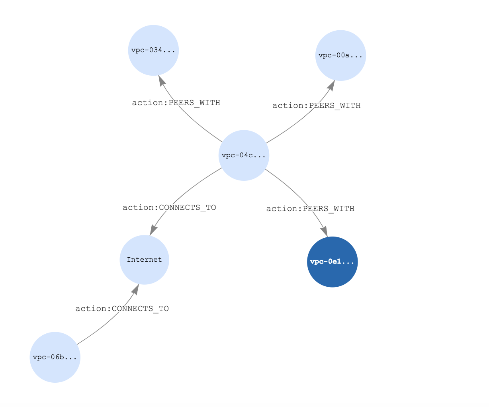

# Introduction

Amazon Neptune allows you to visualize your graph networks as part of Neptune Workbench. Using a series of queries in Gremlin or SPARQL, you can visualize your n-triples data in a graph format which shows their interrelationships that you define. Here we will be demonstrating the utility of Neptune’s relationship database and show how you can view the peering and internet connections between VPC’s in your AWS accounts, assuming you have a star topology. Ensure that you have a VPC with private subnets and a security group that allows all inbound traffic from itself; input this info into the CLI commands. We will also be using Neptune’s built-in integration with SageMaker Notebooks as a workbench for running our queries in SPARQL. Before that, we will need to upload our RDF data in n-triples format to an S3 bucket for easy loading.

The CloudFormation template provided in this repository will create the Neptune resources and also deploy the Lambda function that will discovery Internet Gateways, and VPC Peering Connections. The discovered IGWs and peering connections will be sent to the Neptune database. Currently, the supplied Lambda function only looks for resources in the AWS account it is deployed in and also the region the Lambda function is being run in.

# Pre-requisites

For this walkthrough, you should have the following pre-requisites:
• An AWS Account with CLI access configured.
• A VPC enabled for internet access in your AWS account. For assistance on setting up a VPC with public and private subnets, please refer to [this guide](https://docs.aws.amazon.com/appstream2/latest/developerguide/create-configure-new-vpc-with-private-public-subnets-nat.html).
• An S3 bucket which you can put to and read objects from.

# Package the Lambda function in a Zip file

```
zip vpcgraph.zip vpcgraph.py
```

# Copy the Lambda function Zip file to the S3 bucket

```
aws s3 cp vpcgraph.zip s3://{bucket}
```

# Create the CloudFormation stack that provisions the Neptune cluster and Lambda function

### Substitute in your bucket name and list of security group ID(s) and private subnet IDs (both lists being comma separated)

```
aws cloudformation deploy       \
  --template-file template.yaml \
  --stack-name vpcgraph-lambda  \
  --parameter-overrides         \
    BucketName={bucket}         \
    VPCSecurityGroupIds={sgids} \
    VPCSubnetIds={subnetids}    \
    ObjectName=vpcgraph.zip     \
  --capabilities CAPABILITY_IAM CAPABILITY_NAMED_IAM
```

# Invoke the Lambda function

## Two commands:

```
1) function_name=$(aws cloudformation describe-stacks --stack-name=vpcgraph-lambda --query "Stacks[0].Outputs[?OutputKey=='LambdaFunctionName'].OutputValue" --output text)

2) aws lambda invoke --function-name $function_name /tmp/function_invoke_output
```

From the Lambda console, you will be able to view the logs. Here is a sample output:

```
START RequestId: abdb1cfa-b2b5-400b-a187-88c0570df5c8 Version: $LATEST
<http://xmlns.com/foaf/0.2/vpc-04cd1d79>  <http://purl.org/dc/elements/PEERS_WITH> <http://xmlns.com/foaf/0.2/vpc-0e1b1da8fab34b3f9> .

<http://xmlns.com/foaf/0.2/vpc-04cd1d79> <http://www.w3.org/2000/01/rdf-schema#label> vpc-04cd1d79 .

<http://xmlns.com/foaf/0.2/vpc-04cd1d79>  <http://purl.org/dc/elements/PEERS_WITH> <http://xmlns.com/foaf/0.2/vpc-0341a5de3163e15bb> .

<http://xmlns.com/foaf/0.2/vpc-04cd1d79> <http://www.w3.org/2000/01/rdf-schema#label> vpc-04cd1d79 .

<http://xmlns.com/foaf/0.2/vpc-04cd1d79>  <http://purl.org/dc/elements/PEERS_WITH> <http://xmlns.com/foaf/0.2/vpc-00aa97da7f1b87fd1> .

<http://xmlns.com/foaf/0.2/vpc-04cd1d79> <http://www.w3.org/2000/01/rdf-schema#label> vpc-04cd1d79 .

<http://xmlns.com/foaf/0.2/vpc-06b688d7d68e089bb> <http://purl.org/dc/elements/CONNECTS_TO> internet .

<http://xmlns.com/foaf/0.2/vpc-06b688d7d68e089bb> <http://www.w3.org/2000/01/rdf-schema#label> vpc-06b688d7d68e089bb .

<http://xmlns.com/foaf/0.2/vpc-04cd1d79> <http://purl.org/dc/elements/CONNECTS_TO> internet .

<http://xmlns.com/foaf/0.2/vpc-04cd1d79> <http://www.w3.org/2000/01/rdf-schema#label> vpc-04cd1d79 .

upload done
200
{
    "status" : "200 OK",
    "payload" : {
        "loadId" : "88b64b89-91f4-448b-9841-539fdb6a7bf8"
    }
}
END RequestId: abdb1cfa-b2b5-400b-a187-88c0570df5c8
REPORT RequestId: abdb1cfa-b2b5-400b-a187-88c0570df5c8	Duration: 620.49 ms	Billed Duration: 700 ms	Memory Size: 128 MB	Max Memory Used: 87 MB
```

After uploading the data to Neptune via Lambda and S3, the cluster instance can then be queried using SPARQL to show the relationships amongst all of the VPC’s.

1. From within the Neptune console, navigate to the Notebooks section on the left.
2. Select ‘Create Notebook’ towards the right and follow the steps to create a notebook for the existing Cluster. Allow it to create an IAM role.
3. Once created (this may take a few minutes), select the notebook by name and select ‘Open Notebook’ to the right.
4. Select the ‘Neptune’ and ‘01-Getting-Started’ folders, respectively.
5. Select and open the ‘03-Using-RDF-and-SPARQL-to-Access-the-Graph.ipynb’ file
6. The boxes with the queries will be in this file.

Select any box and run the following SPARQL query:

```
%%sparql
PREFIX action: <http://purl.org/dc/elements/>
SELECT ?s ?p ?o WHERE {?s ?p ?o}
```

Click the tab for graphs and the resulting image will be there. In our case it looks like the following:


